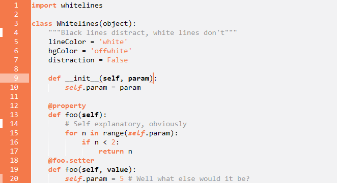
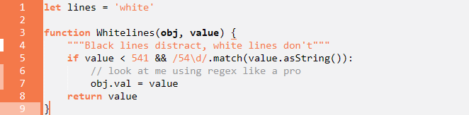

# It’s easy; dark lines distract, white lines don’t.

To anyone who has used <a href="https://www.whitelinespaper.com/">Whitelines</a>TM notepads, this theme should be familiar! This theme, based on the notebooks, uses a light grey background with white highlighting and indentation lines. The margin and syntax highlighting use the notebooks' iconic neon orange for a styling, high-contrast look, while comments are a mid-grey for minimal distraction.

## Screenshots

